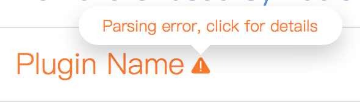

# FAQ

## Why my new shortcut is not working?

This plugin will check usability for your new shortcut keys base on the [Sketch official shortcut list](https://sketchapp.com/learn/documentation/shortcuts/shortcuts/), but it perhaps not contains some special keys, so if your new shortcut are not working, I recommend you try a new one that meet the following points:

1. Use at least two keys;
2. Avoid using special keys like `ESC`, `Space` or `Enter`.

On the other hand, Sketch will not update the shortcut configurations immediately, so you can try the new shortcut again later.

If it still not working, you can [create an issure](#how-to-create-a-high-quality-issue) to report it.

## What is the parsing error?

If you have install very, very much plugins, perhaps you will see one or more `parsing error` plugins, like this:

This error is basically the plugin's `manifest.json` file format error caused, although this plugin always try to handle unexpected format, but it cannot handle all exceptions exactly, so please [open an issue](#how-to-create-a-high-quality-issue) and put the error log([how to get the error log?](#how-to-get-the-error-log)) if you see the `parsing error`, thanks!

## How to get the error log?

Steps:

1. Open `Sketch.app`;
2. Open `Console.app` in the `Applications/Utilities` folder;
3. Type `sketch` in the search box at the top right of the window;
4. Perform the operation which doesnot work properly, eg: Open the `Plugin Shortcuts Management` panel;
5. Copy all output informations in the `Console.app` and paste them in the [Pastebin](https://pastebin.com/);
6. Save it and put the `Pastebin` link in your issue.

## How to create a high quality issue?

In order to help me find the cause of your problem, I hope you can provide all the informations of the [issue-template](../.github/ISSUE_TEMPLATE.md).

Recommended use `Plugins > Sketch Plugin Monster > Feedback` to create a new issue, it will contains version informations automatically.

*Inspired by the [issue helper of `Vue.js`](https://new-issue.vuejs.org/).*
